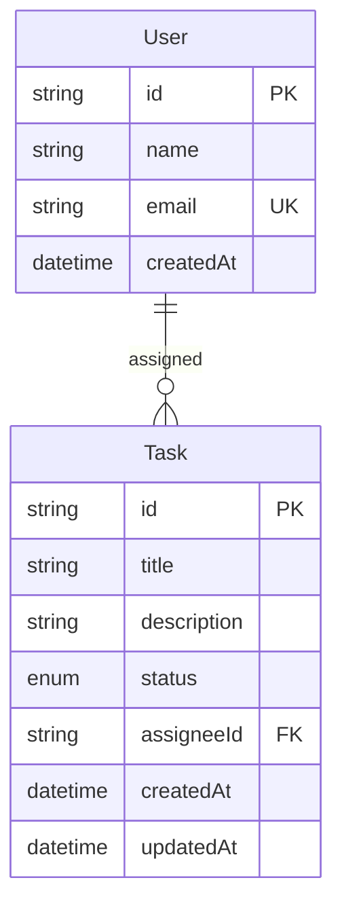

# Team Task Board

Small full-stack task tracker for a take-home assessment: NestJS + Prisma (SQLite) on the backend, React + Redux Toolkit + MUI on the frontend.

**Time spent:** ~4 hours of focused implementation (calendar time was longer because of review pauses between small commits).

## How to run

Requires Node.js 22+.

### Backend

```bash
cd backend
cp .env.example .env
npm install
npx prisma migrate dev
npx prisma generate
npm run prisma:seed
npm run start:dev
```

API: `http://localhost:3000`

- `GET /users`
- `GET /tasks?status=&assigneeId=`
- `POST /tasks`
- `PATCH /tasks/:id/status`
- `DELETE /tasks/:id`

Tests:

```bash
cd backend
npm test
```

### Frontend

```bash
cd frontend
cp .env.example .env
npm install
npm run dev
```

UI: `http://localhost:5173` (talks to `VITE_API_URL`, default `http://localhost:3000`).

## Data model

A `User` can have many `Task`s. Assignee is a required foreign key so listing and filtering by person is a real relation, not a free-text field. Status is an enum (`TODO`, `IN_PROGRESS`, `DONE`) rather than a string so the API and UI stay aligned. Projects, tags, and many-to-many assignees were skipped as extra surface area under the timebox.



## Decisions and tradeoffs

I prioritized a clear Nest module/DTO/service split and a working UI against the real API over extra features. SQLite kept local setup to a copy of `.env` and a migrate/seed, which mattered more than production-grade Postgres for this exercise. REST was the default because the resource set is small and the assessment did not ask for GraphQL. The board is a filterable table with status selects instead of drag-and-drop so the interaction stays obvious and testable. Auth is omitted as specified; seeded users exist only so assignee filters have something to bind to. Prisma 7 requires a driver adapter, so the Nest `PrismaService` and seed script both use `@prisma/adapter-better-sqlite3`. On the frontend, RTK Query holds task/user state so list, create, status update, and delete all invalidate the same cache. Shortcuts I would revisit with more time: `window.confirm` for delete, no pagination, no e2e tests, and the default Nest hello controller left in place because it was not worth a dedicated cleanup pass.
